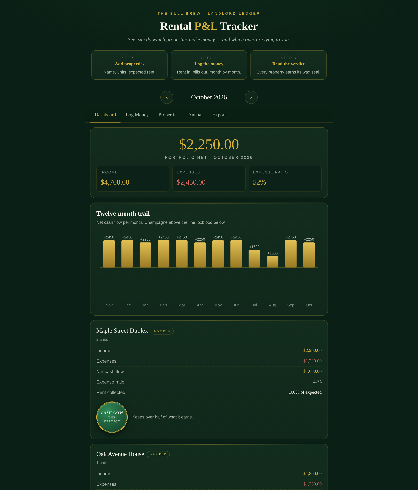

# Rental P&L Tracker

**Live:** https://thebullbrew.github.io/rental-pnl-tracker/

Per-property profit & loss for landlords — see exactly which properties make money and which ones are lying to you. Monthly and annual views, all in your browser.

## What it does

- **Dashboard** — portfolio net cash flow for any month, income vs. expenses vs. expense ratio, and a 12-month net-cash-flow bar trail.
- **Per-property P&L cards** — income, expenses, net, expense ratio, and rent-collection rate per property, each stamped with a wax-seal verdict: **CASH COW**, **TREADING WATER**, or **BLEEDING**.
- **Straight talk** — best/worst property callouts, vacancy warnings when rent collected trails expected rent, and expense-ratio interrogations over 50%.
- **Log money** — income (rent, late fees, other) and expenses (mortgage P&I, taxes, insurance, repairs, CapEx, utilities, management, HOA, other), with edit and delete on every entry.
- **Annual view** — full-year month-by-month net grid per property plus annual totals.
- **Export** — CSV per property or whole portfolio, JSON backup download, JSON restore.

## The method

The ledger doesn't flatter. Net cash flow is income minus expenses, full stop — and every property gets judged on it monthly. The verdict logic is deliberately blunt: keep over half of what you earn and you're a cash cow; spend more than you bring in and you're bleeding. Sample data ships pre-loaded (marked SAMPLE) so you can see it working; clear it with one tap in Export.

## How to run

No backend, no build step, no account. Open `docs/index.html` in any browser, or use the live link above. Installable as a PWA — works offline after first load. All data lives in your browser's localStorage under the key `rentalpnl.v1`.

## Tech

Single self-contained page: HTML + CSS + vanilla JavaScript. Zero dependencies, zero network calls.
